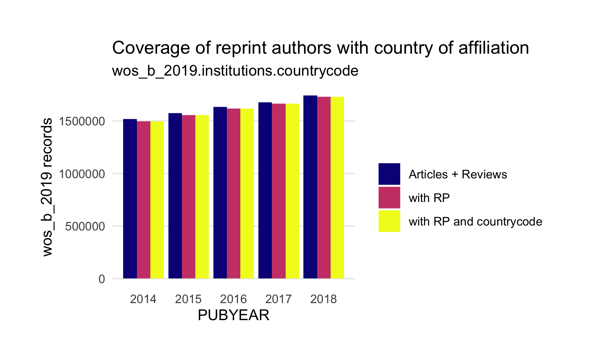
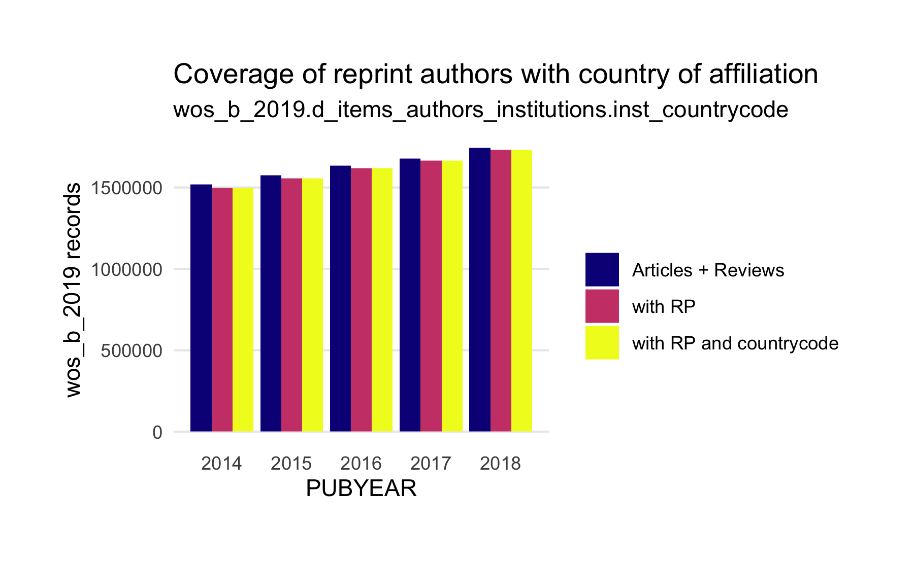

Reprint Author Analysis
================

    #> [1] 0

## Questions

1.  How many records in the Web of Science have affiliation information
    about reprint authors?

2.  How many records in the Web of Science have more than one reprint
    author?

3.  How many reprint authors are co-located (institutional level)?

4.  How many reprint authors are internationally co-located (country
    level)?

5.  What is the collaboration network in terms of country affiliations
    from reprint authors?

Focus:

  - Database: wos\_b\_2019
  - Document Types: Articles and Reviews
  - Database Collections: `WOS.SCI`, `WOS.SSCI`, `WOS.AHCI`
  - Publication Period 2014 -
2018

## Data analysis

### 1\. How many records in the Web of Science have affiliation information at the country level about reprint authors?

#### Articles total

``` sql
select wos_b_2019.items.pubyear, COUNT(DISTINCT(wos_b_2019.items.ut_eid)) as articles_total
    from
        wos_b_2019.items      
    inner join
        wos_b_2019.databasecollection              
            on wos_b_2019.databasecollection.fk_items =  wos_b_2019.items.pk_items        
    where
        wos_b_2019.databasecollection.edition_value in ('WOS.SCI', 'WOS.SSCI', 'WOS.AHCI')                  
        and wos_b_2019.items.doctype in ('Article', 'Review')                   
        and wos_b_2019.items.pubyear in (2014, 2015, 2016, 2017, 2018)
group by wos_b_2019.items.pubyear
```

``` r
articles_total %>% 
  arrange(desc(PUBYEAR))
#>   PUBYEAR ARTICLES_TOTAL
#> 1    2018        1744446
#> 2    2017        1679182
#> 3    2016        1634923
#> 4    2015        1575755
#> 5    2014        1517605
```

#### Records with reprint authors

Using `wos_b_2019.items_authors_institutions.type = 'RP'` to identify
reprint
authors.

``` sql
select wos_b_2019.items.pubyear, COUNT(DISTINCT(wos_b_2019.items.ut_eid)) as rp_articles_total
    from
        wos_b_2019.items      
    inner join
        wos_b_2019.databasecollection              
            on wos_b_2019.databasecollection.fk_items =  wos_b_2019.items.pk_items        
    inner join
        wos_b_2019.items_authors_institutions                                        
            on wos_b_2019.items_authors_institutions.fk_items = wos_b_2019.items.pk_items     
    where
        wos_b_2019.databasecollection.edition_value in ('WOS.SCI', 'WOS.SSCI', 'WOS.AHCI')                  
        and wos_b_2019.items.doctype in ('Article', 'Review')                   
        and wos_b_2019.items.pubyear in (2014, 2015, 2016, 2017, 2018)              
        and wos_b_2019.items_authors_institutions.type = 'RP'
    group by wos_b_2019.items.pubyear
```

``` r
rp_articles_total %>% 
  arrange(desc(PUBYEAR))
#>   PUBYEAR RP_ARTICLES_TOTAL
#> 1    2018           1731851
#> 2    2017           1664849
#> 3    2016           1619696
#> 4    2015           1556981
#> 5    2014           1498393
```

#### Reprint authors records with country information

*Retrieval considerations*

[An earlier exploration](kb_rp_exploration.md) studying how affiliations
from reprint authors are represented in the WOS-KB revealed that only
one affiliation is tagged with `RP in the
table`wos\_b\_2019.items\_author\_institutions\` per author. To obtain
all affiliations per reprint author, the following retrieval strategy
can be used:

1.  Get all authors tagged as RP per item
2.  Obtain all institutional addresses per rp\_author-item combination
    including countrycode
3.  Summarize observations

*Country codes*

There are two tables containing country codes,
`wos_b_2019.institutions.countrycode` and
`wos_b_2019.d_items_authors_institutions.inst_countrycode`. First,
*`wos_b_2019.institutions.countrycode`* is analyzed

``` sql
select
        d.pubyear, count(distinct(d.ut_eid)) as rp_cc_articles_total
    from
        wos_b_2019.items_authors_institutions 
    inner join
        (
            select
                pk_items,
                fk_authors,
                ut_eid,
                pubyear
            from
                wos_b_2019.items     
            inner join
                wos_b_2019.databasecollection                           
                    on wos_b_2019.databasecollection.fk_items =  wos_b_2019.items.pk_items             
            inner join
                wos_b_2019.items_authors_institutions                                                     
                    on wos_b_2019.items_authors_institutions.fk_items = wos_b_2019.items.pk_items
            where
                wos_b_2019.databasecollection.edition_value in (
                    'WOS.SCI', 'WOS.SSCI', 'WOS.AHCI'
                )                           
                and wos_b_2019.items.doctype in (
                    'Article', 'Review'
                )                            
                and wos_b_2019.items.pubyear in (
                    2014, 2015, 2016, 2017, 2018 
                )                       
                and wos_b_2019.items_authors_institutions.type = 'RP'         
        ) d 
            on (
                wos_b_2019.items_authors_institutions.fk_items = d.pk_items 
                and wos_b_2019.items_authors_institutions.fk_authors = d.fk_authors
            )
         inner join wos_b_2019.institutions on wos_b_2019.institutions.pk_institutions = wos_b_2019.items_authors_institutions.fk_institutions
         where wos_b_2019.institutions.countrycode is not null     
   group by d.pubyear
```

``` r
rp_cc_articles_total %>% 
  arrange(desc(PUBYEAR))
#>   PUBYEAR RP_CC_ARTICLES_TOTAL
#> 1    2018              1731808
#> 2    2017              1664799
#> 3    2016              1619081
#> 4    2015              1556514
#> 5    2014              1498270
```

Data Summary:

``` r
rq_1_df <- articles_total %>%
  left_join(rp_articles_total, by = "PUBYEAR") %>%
  mutate(ARTICLE_RP_RATIO = RP_ARTICLES_TOTAL / ARTICLES_TOTAL) %>%
  left_join(rp_cc_articles_total, by = "PUBYEAR") %>%
  mutate(ARTICLE_CC_RP_RATIO = RP_CC_ARTICLES_TOTAL / ARTICLES_TOTAL) %>%
  arrange(desc(PUBYEAR))
rq_1_df
#>   PUBYEAR ARTICLES_TOTAL RP_ARTICLES_TOTAL ARTICLE_RP_RATIO
#> 1    2018        1744446           1731851             0.99
#> 2    2017        1679182           1664849             0.99
#> 3    2016        1634923           1619696             0.99
#> 4    2015        1575755           1556981             0.99
#> 5    2014        1517605           1498393             0.99
#>   RP_CC_ARTICLES_TOTAL ARTICLE_CC_RP_RATIO
#> 1              1731808                0.99
#> 2              1664799                0.99
#> 3              1619081                0.99
#> 4              1556514                0.99
#> 5              1498270                0.99
```

``` r
rq_1_df %>%
  gather(ARTICLES_TOTAL, RP_ARTICLES_TOTAL, RP_CC_ARTICLES_TOTAL, 
         key = "indicator", value = "wos_articles") %>%
  ggplot(aes(PUBYEAR, wos_articles, fill = indicator)) +
  geom_bar(position="dodge", stat="identity") +
  scale_fill_viridis_d("", option = "C", labels = c("Articles + Reviews", "with RP", "with RP and countrycode")) +
  theme_minimal() +
  labs(y = "wos_b_2019 records", 
       title = "Coverage of reprint authors with country of affiliation",
       subtitle = "wos_b_2019.institutions.countrycode") +
  theme(plot.margin = margin(30, 30, 30, 30)) +
  theme(panel.grid.minor = element_blank()) +
  theme(axis.ticks = element_blank()) +
  theme(panel.grid.major.x = element_blank()) +
  theme(panel.border = element_blank())
```



Next, *`wos_b_2019.d_items_authors_institutions.inst_countrycode`* is
analyzed.

``` sql
  select
        d.pubyear, count(distinct(d.ut_eid)) as rp_d_cc_articles
    from
        wos_b_2019.d_items_authors_institutions 
    inner join
        (
            select
                pk_items,
                fk_authors,
                ut_eid,
                pubyear
            from
                wos_b_2019.items     
            inner join
                wos_b_2019.databasecollection                           
                    on wos_b_2019.databasecollection.fk_items =  wos_b_2019.items.pk_items             
            inner join
                wos_b_2019.items_authors_institutions                                                     
                    on wos_b_2019.items_authors_institutions.fk_items = wos_b_2019.items.pk_items
            where
                wos_b_2019.databasecollection.edition_value in (
                    'WOS.SCI', 'WOS.SSCI', 'WOS.AHCI'
                )                           
                and wos_b_2019.items.doctype in (
                    'Article', 'Review'
                )                            
                and wos_b_2019.items.pubyear in (
                    2014, 2015, 2016, 2017, 2018
                )                       
                and wos_b_2019.items_authors_institutions.type = 'RP'         
        ) d 
            on (
                wos_b_2019.d_items_authors_institutions.fk_items = d.pk_items 
                and wos_b_2019.d_items_authors_institutions.fk_authors = d.fk_authors
            )
         where wos_b_2019.d_items_authors_institutions.inst_countrycode is not null     
   group by d.pubyear
```

``` r
rp_d_cc_articles_total
#>   PUBYEAR RP_D_CC_ARTICLES
#> 1    2018          1731808
#> 2    2014          1498271
#> 3    2017          1664800
#> 4    2015          1556568
#> 5    2016          1619163
```

``` r
rp_df_d <- articles_total %>%
  left_join(rp_articles_total, by = "PUBYEAR") %>%
  mutate(ARTICLE_RP_RATIO = RP_ARTICLES_TOTAL / ARTICLES_TOTAL) %>%
  left_join(rp_d_cc_articles_total, by = "PUBYEAR") %>%
  mutate(RP_D_CC_ARTICLES_RATIO = RP_D_CC_ARTICLES / ARTICLES_TOTAL) %>%
  arrange(desc(PUBYEAR))
rp_df_d
#>   PUBYEAR ARTICLES_TOTAL RP_ARTICLES_TOTAL ARTICLE_RP_RATIO
#> 1    2018        1744446           1731851             0.99
#> 2    2017        1679182           1664849             0.99
#> 3    2016        1634923           1619696             0.99
#> 4    2015        1575755           1556981             0.99
#> 5    2014        1517605           1498393             0.99
#>   RP_D_CC_ARTICLES RP_D_CC_ARTICLES_RATIO
#> 1          1731808                   0.99
#> 2          1664800                   0.99
#> 3          1619163                   0.99
#> 4          1556568                   0.99
#> 5          1498271                   0.99
```

``` r
rp_df_d %>%
  gather(ARTICLES_TOTAL, RP_ARTICLES_TOTAL, RP_D_CC_ARTICLES, 
         key = "indicator", value = "wos_articles") %>%
  ggplot(aes(PUBYEAR, wos_articles, fill = indicator)) +
  geom_bar(position="dodge", stat="identity") +
  scale_fill_viridis_d("", option = "C", labels = c("Articles + Reviews", "with RP", "with RP and countrycode")) +
  theme_minimal() +
  labs(y = "wos_b_2019 records", 
       title = "Coverage of reprint authors with country of affiliation",
       subtitle = "wos_b_2019.d_items_authors_institutions.inst_countrycode") +
  theme(plot.margin = margin(30, 30, 30, 30)) +
  theme(panel.grid.minor = element_blank()) +
  theme(axis.ticks = element_blank()) +
  theme(panel.grid.major.x = element_blank()) +
  theme(panel.border = element_blank())
```



In conclusion, joining with both tables seems feasible, because it
results in a thorough countries of affiliation coverage for reprint
authors. Overall, 99 % of records representing original articles and
reviews in the period 2014 - 2017 provide affiliation information for
reprint authors at the country-level. In the following,
`wos_b_2019.d_items_authors_institutions.inst_countrycode` is
used.

### 2\. How many records in the Web of Science have more than one reprint author?

#### Query

``` sql
select
        distinct         
        d.pubyear,
        d.ut_eid,
        wos_b_2019.d_items_authors_institutions.fk_authors,
        wos_b_2019.d_items_authors_institutions.inst_per_auth_cnt,
        wos_b_2019.d_items_authors_institutions.country_per_auth_cnt     
    from
        wos_b_2019.d_items_authors_institutions      
    inner join
        (
            select
                pk_items,
                fk_authors,
                ut_eid,
                pubyear             
            from
                wos_b_2019.items                  
            inner join
                wos_b_2019.databasecollection                                                
                    on wos_b_2019.databasecollection.fk_items =  wos_b_2019.items.pk_items                          
            inner join
                wos_b_2019.items_authors_institutions                                                                          
                    on wos_b_2019.items_authors_institutions.fk_items = wos_b_2019.items.pk_items                               
            where
                wos_b_2019.databasecollection.edition_value in (
                    'WOS.SCI', 'WOS.SSCI', 'WOS.AHCI'                 
                )                                            
                and wos_b_2019.items.doctype in (
                    'Article', 'Review'                 
                )                                             
                and wos_b_2019.items.pubyear in (
                    2014, 2015, 2016, 2017, 2018                 
                )                                        
                and wos_b_2019.items_authors_institutions.type = 'RP'                  
        ) d              
            on (
                wos_b_2019.d_items_authors_institutions.fk_items = d.pk_items                  
                and wos_b_2019.d_items_authors_institutions.fk_authors = d.fk_authors             
            )          
    where
        wos_b_2019.d_items_authors_institutions.inst_countrycode is not null
```

#### Backup in KB table space

``` r
dbWriteTable(conn = jdbcConnection, 
             name = "rp_ind_df", 
             value = rp_ind_df,
             overwrite = TRUE)
#> [1] TRUE
```

#### Analysis: Distribution of the number of reprint authors

``` sql
select
        pubyear,
        ut_eid,
        count(fk_authors) as n_au
    from
        rp_ind_df 
    group by
        ut_eid,
        pubyear 
```

Summary statistics

``` r
summary(rp_au$N_AU)
#>    Min. 1st Qu.  Median    Mean 3rd Qu.    Max. 
#>       1       1       1       1       1      32
```

Frequency table of the number of reprint authors per publication.
Publications with more than five reprint authors per publication were
reduced to the residual category “\> 5”.

``` r
tp_au_count <- rp_au %>% 
  mutate(N_AU = fct_other(factor(N_AU), keep = c("1", "2", "3", "4", "5"),
                          other_level = "> 5")) %>% 
  group_by(N_AU, PUBYEAR) %>% 
  summarize(N = n()) %>% 
  ungroup() %>% 
  group_by(PUBYEAR) %>% 
  mutate(PROP = N / sum(N))
tp_au_count %>%
  ggplot(aes(N_AU, PROP, fill = factor(PUBYEAR))) +
  geom_bar(stat = "identity") +
  scale_fill_brewer(type = "qual", palette = "Set1") +
  facet_grid( ~ factor(PUBYEAR)) +
  scale_y_continuous(labels = scales::percent_format(accuracy = 5L)) +
  labs(
    x = "Number of reprint authors per record",
    y = "Proportion",
    title = "Number of reprint authors per Web of Science record",
    subtitle = "Articles and reviews 2014 - 2018"
  ) +
  theme_minimal() +
  theme(legend.position = "none") +
  theme(plot.margin = margin(30, 30, 30, 30)) +
  theme(panel.grid.minor = element_blank()) +
  theme(axis.ticks = element_blank()) +
  theme(panel.grid.major.x = element_blank()) +
  theme(panel.border = element_blank())
```


SQL statement to retrieve all publications with more than one reprint
author (incl. country info)

``` sql
select
        pubyear,
        ut_eid,
        count(fk_authors)  
    from
        rp_ind_df 
    group by
        ut_eid,
        pubyear 
    having
        count(fk_authors) > 1
```

In total, 497,230 out of 8,070,610 records indexed in the Web of Science
for the period 2014 - 2017 have more than one reprint author,
representing a percentage of 6.2 %. Furthermore, data exploration
suggests that starting from 2016 the Web of Science has begun to
systematically keep track of more than one reprint author.

### 3\. How many reprint authors are co-located (institutional level)?

#### Query

``` sql
select
        inst_per_auth_cnt,
        pubyear,
        count(*) as inst_n
    from
        rp_ind_df 
    group by
        pubyear,
        inst_per_auth_cnt
```

#### Analysis

Distribution of the number of institutional affiliations per reprint
author and year

``` r
rp_inst_au_df <- rp_inst_au_count %>%
  mutate(INST_PER_AUTH_CNT = fct_other(
    factor(INST_PER_AUTH_CNT),
    keep = c("1", "2", "3", "4", "5"),
    other_level = "> 5"
  )) %>%
  ungroup() %>%
  group_by(PUBYEAR) %>%
  mutate(PROP = INST_N / sum(INST_N)) %>%
  arrange(INST_PER_AUTH_CNT, PUBYEAR)

rp_inst_au_df %>%
  ggplot(aes(
    x = factor(INST_PER_AUTH_CNT),
    PROP,
    fill = factor(PUBYEAR)
  )) +
  geom_bar(stat = "identity") +
  scale_fill_brewer(type = "qual", palette = "Set1") +
  facet_grid( ~ PUBYEAR) +
  scale_y_continuous(labels = scales::percent_format(accuracy = 5L)) +
  labs(
    x = "Number of Institutions",
    y = "Proportion",
    title = "Institutional affiliations per reprint author",
    caption = "Derived from wos_b_2019.D_ITEMS_AUTHORS_INSTITUTIONS.INST_PER_AUTH_CNT"
  ) +
  theme_minimal() +
  theme(legend.position = "none") +
  theme(plot.margin = margin(30, 30, 30, 30)) +
  theme(panel.grid.minor = element_blank()) +
  theme(axis.ticks = element_blank()) +
  theme(panel.grid.major.x = element_blank()) +
  theme(panel.border = element_blank())
```


Overall, around half of the reprint authors indexed listed more than one
institutional affiliation (N = 4,148,308, Proportion = 48
%).

### 4\. How many reprint authors are internationally co-located (country level)?

#### Query

``` sql
select
        country_per_auth_cnt,
        pubyear,
        count(*) as country_n
    from
        rp_ind_df 
    group by
        pubyear,
        country_per_auth_cnt
```

Frequency table of the number of country affiliation per reprint author
and publication. Reprint authors with more than three countries of
affiliation at the time of publication were reduced to the residual
category “Other”.

``` r
rp_country_au_df <- rp_country_au_count %>%
  mutate(COUNTRY_PER_AUTH_CNT = fct_other(
    factor(COUNTRY_PER_AUTH_CNT),
    keep = c("1", "2", "3"),
    other_level = "> 3"
  )) %>%
  ungroup() %>%
  group_by(PUBYEAR) %>%
  mutate(PROP = COUNTRY_N / sum(COUNTRY_N)) %>%
  arrange(COUNTRY_PER_AUTH_CNT, PUBYEAR)
```

``` r
rp_country_au_df
#> # A tibble: 39 x 4
#> # Groups:   PUBYEAR [5]
#>    COUNTRY_PER_AUTH_CNT PUBYEAR COUNTRY_N   PROP
#>    <fct>                  <dbl>     <dbl>  <dbl>
#>  1 1                       2014   1441013 0.962 
#>  2 1                       2015   1495351 0.960 
#>  3 1                       2016   1709133 0.945 
#>  4 1                       2017   1740170 0.944 
#>  5 1                       2018   1828802 0.942 
#>  6 2                       2014     55434 0.0370
#>  7 2                       2015     59977 0.0385
#>  8 2                       2016     96786 0.0535
#>  9 2                       2017     99119 0.0538
#> 10 2                       2018    107512 0.0554
#> # … with 29 more rows
```

``` r
rp_country_au_df %>%
  ggplot(aes(
    x = factor(COUNTRY_PER_AUTH_CNT),
    PROP,
    fill = factor(PUBYEAR)
  )) +
  geom_bar(stat = "identity") +
  scale_fill_brewer(type = "qual", palette = "Set1") +
  facet_grid( ~ PUBYEAR) +
  scale_y_continuous(labels = scales::percent_format(accuracy = 5L)) +
  labs(
    x = "Number of Countries",
    y = "Proportion",
    title = "Country affiliations per reprint author",
    caption = "Derived from wos_b_2019.D_ITEMS_AUTHORS_INSTITUTIONS.COUNTRY_PER_AUTH_CNT"
  ) +
  theme_minimal() +
  theme(legend.position = "none") +
  theme(plot.margin = margin(30, 30, 30, 30)) +
  theme(panel.grid.minor = element_blank()) +
  theme(axis.ticks = element_blank()) +
  theme(panel.grid.major.x = element_blank()) +
  theme(panel.border = element_blank())
```


Although the number of co-located reprint authors is growing, only a
small proportion of reprint author is internationally co-located (N =
434,331, Proportion = 5
%).

### 5\. What is the collaboration network in terms of country affiliations from reprint authors?

#### Query

Obtain publications with country
affiliations

``` sql
select  distinct wos_b_2019.d_items_authors_institutions.INST_COUNTRYCODE,       
        d.ut_eid
    from
        wos_b_2019.d_items_authors_institutions      
    inner join
        (
            select
                pk_items,
                fk_authors,
                ut_eid,
                pubyear             
            from
                wos_b_2019.items                  
            inner join
                wos_b_2019.databasecollection                                                
                    on wos_b_2019.databasecollection.fk_items =  wos_b_2019.items.pk_items                          
            inner join
                wos_b_2019.items_authors_institutions                                                                          
                    on wos_b_2019.items_authors_institutions.fk_items = wos_b_2019.items.pk_items                               
            where
                wos_b_2019.databasecollection.edition_value in (
                    'WOS.SCI', 'WOS.SSCI', 'WOS.AHCI'                 
                )                                            
                and wos_b_2019.items.doctype in (
                    'Article', 'Review'                 
                )                                             
                and wos_b_2019.items.pubyear in (
                    2014, 2015, 2016, 2017, 2018                 
                )                                        
                and wos_b_2019.items_authors_institutions.type = 'RP'                  
        ) d              
            on (
                wos_b_2019.d_items_authors_institutions.fk_items = d.pk_items                  
                and wos_b_2019.d_items_authors_institutions.fk_authors = d.fk_authors             
            )          
    where
        wos_b_2019.d_items_authors_institutions.inst_countrycode is not null
```

#### Analysis

Publications with internationally co-located reprint author(s)

``` r
co_pubs <- rp_country_mat %>% 
  group_by(UT_EID) %>%
  filter(n() > 1)
```

Country share

``` r
all_count <- rp_country_mat %>%
  count(INST_COUNTRYCODE, sort = TRUE)
co_count <- co_pubs %>%
  ungroup() %>%
  count(INST_COUNTRYCODE, sort = TRUE, name = "n_co")
left_join(all_count, co_count, by = "INST_COUNTRYCODE") %>%
  mutate(prop = n_co / n * 100) 
#> # A tibble: 249 x 4
#>    INST_COUNTRYCODE       n   n_co  prop
#>    <chr>              <int>  <int> <dbl>
#>  1 USA              1675266 135429  8.08
#>  2 CHN              1492259  95259  6.38
#>  3 GBR               410762  63330 15.4 
#>  4 DEU               391561  52884 13.5 
#>  5 JPN               332902  20692  6.22
#>  6 IND               292829  12520  4.28
#>  7 KOR               259593  13445  5.18
#>  8 ITA               258881  22743  8.79
#>  9 FRA               253486  35473 14.0 
#> 10 CAN               246357  27937 11.3 
#> # … with 239 more rows
```

Create bi-partite
matrix

``` r
#co_pubs_mat <- as.matrix(table(co_pubs$UT_EID, co_pubs$INST_COUNTRYCODE))
```

calculate unipartite matrix (country level)

``` r
#co_pubs_mat_t <- t(co_pubs_mat) %*% co_pubs_mat
```

visualise network (tbc)

``` r
# library(sna)
# sna::gplot(co_pubs_mat_t, 
#            gmode = "graph", 
#            vertex.cex = log(diag(co_pubs_mat_t)^0.3),
#            usearrows = FALSE)
```
