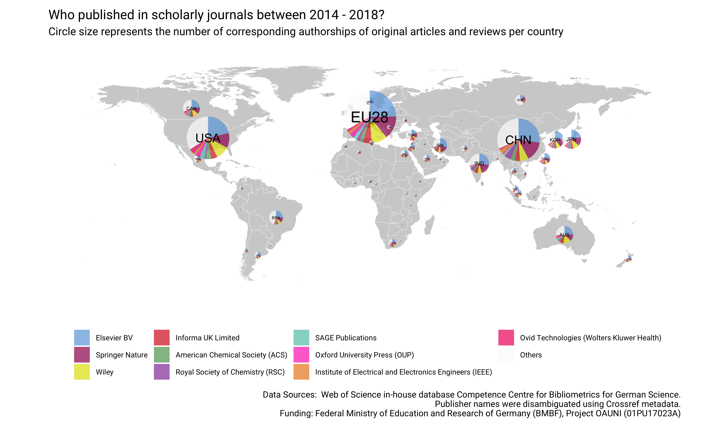

```{r, echo = FALSE, message = FALSE, warning = FALSE}
library(tidyverse)
library(janitor)
library(scatterpie)
library(knitr)
knitr::opts_chunk$set(
  comment = "#>",
  collapse = TRUE,
  warning = FALSE,
  message = FALSE,
  echo = FALSE,
  fig.width = 6,
  fig.asp = 0.618,
  out.width = "70%",
  fig.align = "center",
  dpi = 300
)

options(scipen = 999, digits = 2)
knitr::knit_hooks$set(
  inline = function(x) {
    if (is.numeric(x)) {
      return(prettyNum(x, big.mark = ","))
    } else{
      return(x)
    }
  }
)
```

## Background & summary

Assessing the volume and share of corresponding author publications is crucial for the planning of open access funding programs and licensing models [@Schimmer_2015]. However, funders and national library consortia often lack access to bibliometric data, which allows for determining the publication output per publisher, journal and journal business model across countries. Here, by obtaining country affiliations from the Web of Science at the level of journals, and combining them with normalized publisher and open access status information, we created a dataset about the productivity of corresponding authors for the period 2014-2018. This dataset is expected to have essential value for the quantitative understanding of scholarly publishing. It will not only help to analyze the market share of publishing houses, but will also uncover the current state of the transition of subscription-based publishing models to fully open access.

Only a few openly available datasets focusing on the scholarly publishing industry exist. For example, @haustein_2015 shared an aggregated dataset that contains the market share of publishers in terms of articles indexed in the Web of Science between 1973-2013. Using this data, the authors were able to reveal a growing market concentration among a few publishing houses [@Larivi_re_2015]. @Palzenberger_2015 provided a dataset presenting the number and proportion of scholarly articles by country of affiliation including a breakdown by author role for the period 2004-2014. Published in 2015, this dataset, which was obtained from the Web of Science in-house database from the German Competence Center for Bibliometrics, formed the empirical basis for demonstrating that a large-scale transition from a subscription-based to an open access business model would be financially feasible in terms of the global amount spent on subscriptions [@Schimmer_2015]. Since then, analyzing corresponding author publications has become a critical component of open access negotiations between library consortia and publishers [@Geschuhn_2017].

There have also been analytical applications for such datasets. Major bibliometric databases including the Web of Science, Scopus and Dimension have started to integrate open access status information. In these databases, Unpaywall data is often used to identify openly available full-texts at the article-level, while the Directory of Open Access Journals provides information about if a journal is fully open access. In its most recent edition, the Leiden Ranking presents open access indicators at the level of universities [@leiden]. In addition to university-specific data, the German Open Access Monitor provides breakdowns by publisher and journal and includes publications from non-university research institutions based in Germany [@oa_monitor].

Here, we build an open dataset on the global productivity of corresponding authors. Drawing on Palzenberger's (2015) previous work, we not only created an updated dataset about the number and proportion of scholarly articles per country of affiliation from corresponding authors. The dataset also allows for a breakdown by journal, including information whether it was operated as a subscription or fully open access journal, and by publishers. We constructed the dataset using the quality-assured Web of Science in-house database from the German Competence Center for Bibliometrics. We enriched the data with publisher information from Crossref, a large DOI registration agency for scholarly work, and with open access journal information provided by the ISSN-GOLD-OA list, a dataset that merges open access journal information from the DOAJ, OpenAPC, PubMed and ROAD [@issn]. 

The data does not only provide background information for negotiations in the context of transformative agreements, but can also be used in the quantitative study of the scholarly publishing industry and the open access uptake across countries. For instance, national transformative agreements with large publishers will increase opportunities to publish open access. The existence of such agreements will therefore likely have an impact on the open access share of a country with such agreements. To demonstrate the dataset's significance, we will present two new findings using the dataset: a global map of publishers's market share, and an analysis of country of affiliation by publisher. Source code used for compiling the dataset is shared along with the resulting datasets. 

## Methods

Following @Palzenberger_2015, data were retrieved from the in-house Web of Science database maintained by the German Competence Center for Bibliometrics. The following data were obtained and aggregated:

- Web of Science collections SCI, SSCI and AHCI
- Article types Original Articles and Reviews
- Country of affiliations
- ISSN
- Publication years 2014 - 2018 
- Author roles, interpreting the role "reprint author" as corresponding authorship.

Like @Palzenberger_2015, the above-listed selection reflect data needs in the context of open access negotiations between library consortia and publishers. The restriction to the article types original article and reviews is in accordance with most open access contracts where other types of journal content like letters or meeting abstracts are not considered (see for instance @Sander_2019). 

To allocate open access costs to institutions, @Schimmer_2015 proposed to use affiliations from corresponding authors, presuming that corresponding author affiliations can be counted straight. Under this counting method, only one institution or one country receives full credit for a publication [@Huang_2011]. However, there have been some concerns with using corresponding authorship’s data from bibliometric databases for cost analysis recently. @Gumpenberger_2018 noted two potential issues: multiple corresponding author affiliations and multiple corresponding authors per article. 

Indeed, the Web of Science has begun to systematically keep track of more than one corresponding author recently: We found that the Web of Science did record more than one corresponding author for 6.2% of indexed articles published between 2014 - 2018 (see Figure 1). Moreover, a 5% of corresponding authors author was internationally co-located (see Figure 2). We therefore decided to use whole counting where every original article or review was counted once per country of affiliation of the corresponding author(s).


After obtaining aggregated article counts at the level of countries and journals from the Web of Science, Crossref’s REST API was queried using the rcrossref package [@rcrossref] to retrieve publisher and journal titles. To control for developments of the publishing market resulting in name changes of publishers or journal titles over time, only the most frequent field name was used from the API facet counts. Drawing on ISSN-L, a journal identifier that links between different media versions of a journal, ISSN variants were obtained to improve the retrieval. Next, the open access status per journal was identified and added to the dataset using the ISSN-Gold -OA 3.0 list [@issn]. Again, ISSN-L were used for the matching procedure.

## Data and Code availability 

The underlying source code in R and SQL for both testing the retrieval and compiling the datasets are openly shared as executable reports, making our data work more reproducible and transparent. The data analytics work, which was organized as research compendium [@Marwick_2017] using the holepunch R package [@holepunch], is accessible at <https://github.com/subugoe/oa2020cadata>. 

More specifically, the following database retrieval steps were tracked using R Markdown, a reproducible authoring framework supporting various programming languages including R and SQL, and are accessible in the `analysis` folder of the research compendium:

1. Initial exploration about how corresponding authorships are represented in the WoS-KB ([`001_kb_rp_pretest.Rmd`](analysis/001_kb_rp_pretest.Rmd)) 
2. Coverage analysis of reprint authors in the WoS-KB for the period 2014 - 2018 ([`002_kb_rp_coverage.Rmd`](analysis/002_kb_rp_coverage.Rmd)). 
3. Steps to obtain and compile the dataset about corresponding author country affiliations 2014 - 2018([`003_kb_fetch_ca.Rmd`](analysis/003_kb_fetch_ca.Rmd)) 
4. Steps to obtain and compile the dataset about the global publisher output 2014 - 2018 ([`004_kb_fetch_publisher.Rmd`](analysis/004_kb_fetch_publisher.Rmd)). 

The research compendium contains the rendered reports as well. Furthermore, this source code repository includes comprehensive reproducibility guidance for users with access to the in-house data infrastructure provided by the Competence Centre for Bibliometrics for German Science.

## The Dataset

Overall, our dataset consists of the following two separate tables:

- `journal_publisher_14_18`: Global journal and publisher data 2014-18
- `rp_jn_14_18.csv`: Corresponding author country affiliations per publisher and journal 2014-18

They are provided as comma-separated values (csv) files and Excel spreadsheets.  

The data are openly available in the `data/` of the research compendium hosted on GitHub <https://github.com/subugoe/oa2020cadata>.

### Global journal and publisher data

```{r}
publisher_df <- readr::read_csv("../data/journal_publisher_14_18.csv")
```

The first file, named `journal_publisher_14_18`, contains information about the publishing market landscape for the period 2014-2018 in terms of the aggregated number of articles and reviews  by year and journal represented by the ISSN identifier indexed in the Web of Science. Table 1 describes the data variables in detail. We were able to retrieve publisher and journal titles from Crossref for `r publisher_df %>% filter(!is.na(publisher)) %>% distinct(issn_l) %>% nrow() / publisher_df %>% distinct(issn_l) %>% nrow() * 100` %
 of all journals, representing `r publisher_df %>% filter(!is.na(publisher)) %>% .$articles %>% sum() / sum(publisher_df$articles) * 100` % of the overall article volume. `r publisher_df %>% filter(oa_journal == TRUE) %>% distinct(issn_l) %>% nrow()` out of `r publisher_df %>% filter(!is.na(publisher)) %>% distinct(issn_l) %>% nrow()`
 investigated journals with `ISSN-L` were identified as fully open access journals. In total, the dataset provides information for `r sum(publisher_df$articles)` records indexed in the Web of Science with journal information in the five-years period 2014-2018.

Data Schema `journal_publisher_14_18`:

| Variable           | Description                                                                                                                                 | Source                                                                                         |
| :----------------- | :------------------------------------------------------------------------------------------------------------------------------------------ | :--------------------------------------------------------------------------------------------- |
| `issn_wos`         | ISSN, a standardized journal id.                                                                                                            | KB Web of Science: `wos_b_2019.issues.issn`                                                    |
| `publication_year` | Year of publication, obtained from KB Web of Science                                                                                        | KB Web of Science: `wos_b_2019.items.pubyear`                                                  |
| `articles`         | Number of original articles and reviews published.                                                                                          | KB Web of Science: Grouped counts over `wos_b_2019.issues.issn` and `wos_b_2019.items.pubyear` |
| `journal_title`    | Most frequently used journal title in terms of articles published between 2014 - 2018. If missing, the journal was not indexed in Crossref  | Crossref                                                                                       |
| `publisher`        | Most frequently used publisher name in terms of articles published between 2014 - 2018. If missing, the journal was not indexed in Crossref | Crossref                                                                                       |
| `oa_journal`       | Is the journal publishing all articles open access without delay (full open access)?                                                        | ISSN-GOLD_OA List 3.0                                                                     |
| `issn_l`           | Linking ISSN, a journal id that groups the different media of the same serial publication, e.g. ISSN for print with electronic issn.        | CIEPS                                                                                          |

### Corresponding author data

```{r}
rp_df <- readr::read_csv("../data/rp_jn_14_18.csv")
```

The file named `rp_jn_14_18` provides a breakdown of journal information aggregated by  countries of affiliation. Only corresponding authorships, indicated by the role "reprint author" in the Web of Science database, were taken into consideration. The following table  describes the variables in detail. Overall, 99 % of records representing original articles and reviews in the period 2014 - 2018 had affiliation information for corresponding authors at the country-level.


Data
Schema:

| Variable           | Description                                                                                                                                                                      | Source                                                                                                                                                     |
| :----------------- | :------------------------------------------------------------------------------------------------------------------------------------------------------------------------------- | :--------------------------------------------------------------------------------------------------------------------------------------------------------- |
| `issn_wos`         | ISSN, a standardized journal id.                                                                                                                                                 | KB Web of Science: `wos_b_2019.issues.issn`                                                                                                                |
| `country_code`     | Country of affiliation corresponding author, represented as ISO 3 code                                                                                                           | KB Web of Science: `wos_b_2019.d_items_authors_institutions.inst_countrycode`                                                                              |
| `publication_year` | Year of publication, obtained from KB Web of Science                                                                                                                             | KB Web of Science: `wos_b_2019.items.pubyear`                                                                                                              |
| `articles`         | Number of original articles and reviews published. Whole counting where internationally co-located corresponding authorships were assigned to each contributing country equally. | KB Web of Science: Grouped counts over `wos_b_2019.issues.issn`, `wos_b_2019.d_items_authors_institutions.inst_countrycode` and `wos_b_2019.items.pubyear` |
| `journal_title`    | Most frequently used journal title in terms of articles published between 2014 - 2018. If missing, the journal was not indexed in Crossref                                       | Crossref                                                                                                                                                   |
| `publisher`        | Most frequently used publisher name in terms of articles published between 2014 - 2018. If missing, the journal was not indexed in Crossref                                      | Crossref                                                                                                                                                   |
| `oa_journal`       | Is the journal publishing all articles open access without delay (full open access)?                                                                                             | ISSN-GOLD_OA List 3.0                                                                                                                              |
| `issn_l`           | Linking ISSN, a journal id that groups the different media of the same serial publication, e.g. ISSN for print with electronic issn.                                             | CIEPS                                                                                                                                                      |

<!--### Corresponding author co-authorship network -->

## Use-cases

### Global publisher market share
 
Based on the dataset `journal_publisher_14_18` the global market share of publishing houses in terms of articles and reviews indexed in the Web of Science can be analyzed for the period 2014-18. The following table  shows the overall market share for the ten largest publishers. The following figure presents a breakdown by journal business model, differentiating between subscription journals and fully open access. 

```{r, results='asis'}
my_df <- readr::read_csv("../data/journal_publisher_14_18.csv")
tt_all <- my_df %>%
  group_by(publisher) %>%
  summarise(n = sum(articles)) %>%
  mutate(prop = n / sum(n))  %>%
  mutate(publisher = ifelse(is.na(publisher), "Other", publisher)) %>%
  arrange(desc(n)) %>%
  mutate(publisher_group = fct_other(publisher, keep = publisher[1:11])) %>%
  ungroup() %>%
  group_by(publisher_group) %>%
  summarise(n = sum(n), prop = sum(prop)) %>%
  mutate(publisher_group = fct_reorder(publisher_group, n, )) %>%
  mutate(publisher_group = fct_relevel(publisher_group, "Other")) %>%
  arrange(desc(publisher_group))
tt_all %>%
  mutate(prop = prop * 100) %>%
  janitor::adorn_totals() %>%
  knitr::kable(
    caption = "Publisher Market Share 2014 - 2018 in terms of articles and reviews indexed in the Web of Science",
    col.names = c("Publisher", "Articles and Reviews published", "Percentage"),
    format.args = list(big.mark = ",")
  )
```

```{r}
tt_oa <- my_df %>%
  mutate(publisher_group = ifelse(publisher %in% tt_all$publisher_group, publisher, "Other")) %>%
  group_by(publisher_group, oa_journal) %>%
  summarise(n = sum(articles)) %>%
  mutate(oa_journal = ifelse(oa_journal == TRUE, "Fully Open Access", "Subscription")) %>%
  ungroup() %>%
  group_by(oa_journal) %>%
  mutate(prop = n / sum(n))
plot_df <- tt_all %>%
  mutate(oa_journal = "All Journals") %>%
  bind_rows(tt_oa) %>%
  group_by(oa_journal) %>%
  mutate(label = format(sum(n), big.mark   = ",")) %>%
  mutate(label = paste0(oa_journal, " (", label, " Articles)")) %>%
  ungroup() %>%
  mutate(publisher_group = factor(publisher_group, levels = levels(tt_all$publisher_group)))
london_palette <-
  c(
    "#6da7de",
    "#9e0059",
    "#dee000",
    "#d82222",
    "#5ea15d",
    "#943fa6",
    "#63c5b5",
    "#ff38ba",
    "#eb861e",
    "#ee266d"
  )
p_bar <-
  ggplot(plot_df, aes(x = "", y = prop, fill = publisher_group)) +
  geom_bar(width = 1,
           stat = "identity",
           position = position_stack(reverse = FALSE)) +
  facet_wrap( ~ label, ncol = 1) +
  coord_flip() +
  geom_text(aes(label = paste0(round(prop, 2) * 100, "")), position = position_stack(vjust = .5)) +
  scale_fill_manual(
    "",
    values = c("grey80", rev(london_palette[1:10])),
    guide = guide_legend(reverse = TRUE,  ncol = 4)
  ) +
  scale_y_continuous(breaks = seq(0, 1, by = 0.1),
                     labels = scales::percent_format(accuracy = 5L)) +
  labs(
    title = "Global Publisher Market Shares 2014 - 2018",
    x = "",
    y = "",
    subtitle = "Original Articles and Reviews indexed in the Web of Science\n\n",
    caption = "Data Sources:  Web of Science in-house database Competence Centre for Bibliometrics for German Science. 
    Publisher names were disambiguated using Crossref metadata. OA status obtained from the Bielefeld GOLD OA list.
    Funding: Federal Ministry of Education and Research of Germany (BMBF), Project OAUNI (01PU17023A)"
  ) +
  #  scale_y_continuous(breaks = seq(0,1, by =0.1), labels = scales::percent_format(accuracy = 5L)) +
  theme_minimal(base_family = "Roboto", base_size = 16) +
  theme(plot.margin = margin(30, 30, 30, 30)) +
  theme(panel.grid.minor = element_blank()) +
  theme(axis.ticks = element_blank()) +
  theme(panel.grid.major.y = element_blank()) +
  theme(panel.border = element_blank()) +
  theme(legend.position = "bottom",
        legend.justification = "center")
dir.create("figure")
ggsave(
  filename = "figure/global_publisher_share.png",
  plot = p_bar,
  width = 14,
  height = 9,
  dpi = 300
)
```


Our data confirms that the global publishing landscape is dominated by a few large publishers. In total, ten publishers accounted for around two-thirds of articles published between 2014 - 2018. The Big 3, Elsevier, Springer Nature and Wiley, secured a market share of 46 %. However, further analysis suggests large differences between subscription and fully open access journals: The market for fully open access journals seems to be less dominated by major publishing houses. A notable exception is Springer Nature with its large fully open access portfolio including BioMed Central and the large mega-journals Scientific Reports and Nature Communications.

### Global Map of Journal Publishing 

Using `rp_14_18` the publisher market shares can be further broken down by country affiliation from corresponding authors. The following figure presents a global map of scholarly journal publishing represented in the Web of Science. Publications from institutions based in the European Union were summarized as "EU28". Together, all EU 28 member states constituted the largest market for journal publishing between 2014-18.

```{r}
my_df <- readr::read_csv("../data/rp_jn_14_18.csv")
#'  transform to eu
eu <-
  c(
    "AUT",
    "BEL",
    "BGR",
    "CYP",
    "CZE",
    "DEU",
    "DNK",
    "ESP",
    "EST",
    "FIN",
    "FRA",
    "GBR",
    "GRC",
    "HRV",
    "HUN",
    "IRL",
    "ITA",
    "LTU",
    "LUX",
    "LVA",
    "MLT",
    "NLD",
    "POL",
    "PRT",
    "ROU",
    "SVK",
    "SVN",
    "SWE"
  )
my_df %>%
  mutate(eu = case_when(country_code %in% eu ~ "EU28")) %>%
  mutate(countries = ifelse(eu %in% "EU28", "EU28", country_code)) -> df_to_plot
#' top 5 publisher closed
my_df %>%
 # filter(oa_journal == FALSE) %>%
  group_by(publisher) %>%
  summarise(n = sum(articles)) %>%
  arrange(desc(n)) %>%
  head(11) %>%
  .$publisher -> top_6
#' data transformation to prepare plotting of corresponding authors' country of affilation
df_to_plot %>%
  mutate(fct_publisher = ifelse(publisher %in% top_6, publisher, "Others")) %>%
  mutate(fct_publisher = ifelse(is.na(fct_publisher), "Others", fct_publisher)) %>%
  group_by(fct_publisher, countries) %>%
  summarize(n = sum(articles)) %>%
  mutate(prop = n / sum(n)) %>%
  ungroup() %>%
  mutate(fct_publisher = factor(fct_publisher, levels = c(top_6[!is.na(top_6)], "Others"))) %>%
  mutate(countries = fct_reorder(countries, n)) -> plot_df
#' add country lat lon
#' eu28 frankfurt main is the center
eu_df <-
  data_frame(
    latitude = 50.6393264,
    longitude = 8.40556572,
    name = "EU28",
    iso3c = "EU28"
  )
library(countrycode)
gc <- readr::read_tsv("../data/geocodes.csv") %>%
  # add iso code used in kb database
  mutate(iso3c = countrycode::countrycode(country, "iso2c", "iso3c")) %>%
  bind_rows(eu_df) %>%
  filter(!iso3c %in% eu)

gc %>%
  select(-country) %>%
  inner_join(plot_df, by = c("iso3c" = "countries")) %>%
  select(-prop) %>%
  spread(fct_publisher, n) %>%
  mutate(all_pubs = rowSums(.[5:11], na.rm = TRUE)) -> plot_wide
tmp <- plot_wide %>%
  arrange(desc(all_pubs)) %>%
  replace(., is.na(.), 0)
#' plot
world <- map_data('world') %>%
  # without Antartica
  filter(region != "Antarctica")
p <- ggplot(world, aes(long, lat)) +
  geom_map(
    map = world,
    aes(map_id = region),
    color = "white",
    size = 0.1,
    fill  = "#b3b3b3a0"
  ) +
  coord_map() +
  scatterpie::geom_scatterpie(
    aes(
      x = longitude,
      y = latitude,
      r = sqrt(all_pubs / 5000)
    ),
    data = tmp,
    cols = c(levels(plot_df$fct_publisher)),
    color = NA,
    alpha = .7
  ) +
  geom_text(
    aes(
      x = longitude,
      y = latitude,
      group = iso3c,
      label = iso3c
    ),
    data = tmp,
    stat = "identity",
    size = sqrt(tmp$all_pubs / 50000)
  ) +
  scale_fill_manual(
    "",
    values = c(london_palette, "#fcfcfc"),
    limits = levels(plot_df$fct_publisher)
  ) +
  coord_equal() +
  theme_minimal()  +
  labs(
    title = "Who did publish in scholarly journals between 2014 - 2018?",
    x = "",
    y = "",
    caption = "Data Sources:  Web of Science in-house database Competence Centre for Bibliometrics for German Science.
    Funding: Federal Ministry of Education and Research of Germany (BMBF), Project OAUNI (01PU17023A)",
    subtitle = "Circle size represents the number of corresponding authorships of original articles and reviews per country\n"
  ) +
  theme_minimal(base_family = "Roboto") +
  theme(plot.margin = margin(10, 30, 10, 30)) +
  theme(panel.grid.minor = element_blank()) +
  theme(axis.ticks = element_blank()) +
  theme(panel.grid.major = element_blank()) +
  theme(panel.border = element_blank()) +
  theme(axis.ticks = element_blank(),
        axis.text = element_blank()) +
  theme(legend.position = "bottom",
        legend.justification = "center") +
  theme(legend.text = element_text(size = 7.5))

ggsave("figure/map.png",
       p,
       dpi = 450,
       height = 6,
       width = 10)
ggsave("figure/map.pdf",
       p,
       device = cairo_pdf,
       dpi = 450,
       height = 6,
       width = 10)
```



The following figure shows the country share per publisher in terms of original articles and reviews published in subscription journals using corresponding author affiliations. The flipped x-axis shows the top 10 countries of affiliations in terms of articles published, while the y-axis depicts the percentage per publisher. The figure indicates, which countries were of particularly importance to a publisher. Furthermore, it suggests large variations across publishers. Take for instance the publisher Royal Society of Chemistry. Around every third article published in a subscription journal was submitted from an author based in China, while the overall share of China-based authors was `r rp_df %>% filter(oa_journal == FALSE) %>% group_by(country_code) %>% summarise(n = sum(articles)) %>% arrange(desc(n)) %>% mutate(prop = n /sum(n)) %>% filter(country_code == "CHN") %>% .$prop * 100` %.

```{r}
top_10_publisher <- rp_df %>%
  filter(oa_journal == FALSE) %>%
  group_by(publisher) %>%
  summarise(n = sum(articles)) %>%
  arrange(desc(n)) %>%
  head(11) %>%
  .$publisher
top_10_countries <- rp_df %>%
  filter(oa_journal == FALSE) %>%
  group_by(country_code) %>%
  summarise(n = sum(articles)) %>%
  arrange(desc(n)) %>%
  head(10) %>%
  .$country_code
plot_df <- rp_df %>%
  filter(oa_journal == FALSE) %>%
  mutate(fct_publisher = ifelse(publisher %in% top_10_publisher, publisher, "Others")) %>%
  mutate(fct_publisher = ifelse(is.na(fct_publisher), "Others", fct_publisher)) %>%
  mutate(fct_countrcode = ifelse(country_code %in% top_10_countries, country_code, "Others")) %>%
  mutate(fct_countrcode = factor(fct_countrcode, levels = c(top_10_countries, "Others"))) %>%
  group_by(fct_publisher, fct_countrcode) %>%
  summarize(n = sum(articles)) %>%
  mutate(prop = n / sum(n)) %>%
  ungroup()
#' plot
ggplot(plot_df, aes(forcats::fct_rev(fct_countrcode), prop, fill = prop)) +
  coord_flip() +
  geom_bar(stat = "identity") +
  facet_wrap(~ fct_relevel(fct_publisher, top_10_publisher), ncol = 3) +
  scale_fill_viridis_c(
    "Country share per publisher (in %)",
    labels = scales::percent_format(accuracy = 5L),
    option = "C"
  ) +
  scale_y_continuous(labels = scales::percent_format(accuracy = 5L))  +
  labs(
    title = "Who did publish in subscription-based journals from major publishers between 2014 - 2018?",
    x = "Country of Affiliation (Top 10)",
    y = "Share of Original Articles and Reviews per Publisher",
    caption = "Data Sources:  Web of Science in-house database Competence Centre for Bibliometrics for German Science.
    Publisher names were disambiguated using Crossref metadata. OA status obtained from the Bielefeld GOLD OA list.
    Funding: Federal Ministry of Education and Research of Germany (BMBF), Project OAUNI (01PU17023A)",
    subtitle = "Corresponding authors' countries of affiliation per publisher."
  ) +
  theme_minimal(base_family = "Roboto", base_size = 16) +
  theme(plot.margin = margin(30, 10, 30, 10)) +
  theme(panel.grid.minor.y = element_blank()) +
  theme(axis.ticks = element_blank()) +
  theme(panel.grid.major.y = element_blank()) +
  theme(panel.border = element_blank()) +
  theme(
    legend.position = "top",
    legend.justification = "right",
    legend.text = element_text(size =  9)
  ) -> p
#' save as png
ggsave(
  "figure/publisher_share.png",
  p,
  dpi = 450,
  height = 13,
  width = 17
)
```


## Responsible use and limitations

Although the Web of Science database is a well-established bibliometric database it has certain limitations that need careful consideration when using and interpreting our data. First, the Web of Science is selective in terms of journal inclusion and is not covering the whole journal portfolio of the investigated publishers. Although publisher names were disambiguated, journal title transfers between publishers were not tracked. Furthermore, the year of inclusion in a journal issue, i.e. print publication date, was used. However, there can be a considerable time-lag between online-first publication and issue inclusion. 

Moreover, as any other bibliometric databases, the data structure can be subject of change. In particular, our pretests suggest that the Web of Science author role field used to identify corresponding authorships has undergone a change recently, starting to covering more than one reprint resp. corresponding author per article.

The ISSN GOLD-OA list [@issn] was used to determine fully open access journals. However, it does not contain information when a subscription-based journal became fully open access. The figures should be therefore interpreted as numbers of articles available in current fully open access journals, instead of published in a fully open access journal at the time of publication. Open access article counts are therefore upper estimates.

In the end, we present a novel bibliometric dataset representing the journal publishing market with a particular focus on open access. Although access to the underlying data infrastructure is restricted, we decided to openly share the aggregated dataset as part of a research compendium to demonstrate the technical reproducibility of this work. 

## Acknowledgment

## References