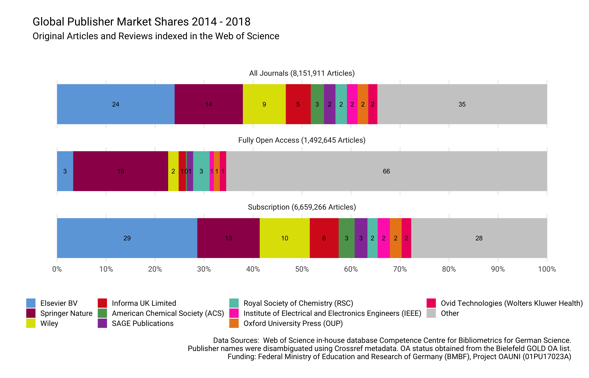

Data Descriptive: Corresponding author journal publishing activities
2014 - 2018
================
9/5/2019

## Background & summary

The volume of corresponding author publications is a crucial indicator
in the planning of open access funding programs and licensing models
(Schimmer, Geschuhn, and Vogler 2015). But funders and national library
consortia often lack access to such bibliometric data. Particularly,
determining the share per publisher, journal and journal business model
across countries is challenging. Here, by obtaining country affiliations
from the Web of Science at the level of journals, and combining them
with normalized publisher and open access status information, we created
a comprehensive dataset about the productivity of corresponding authors
for the period 2014-2018. This dataset is expected to have essential
value for the quantitatve understanding of scholarly publishing. It will
not only help to analyze the market share of publishing houses, but will
also uncover the current state of the transition of subscription-based
publishing models to fully open access.

Only a few openly available datasets focusing on the scholarly
publishing industry exist. For example, Haustein, Larivière, and Mongeon
(2015) shared an aggregated dataset that contains the market share of
publishers in terms of articles indexed in the Web of Science between
1973-2013. Using this data, the authors were able to reveal a growing
market concentration among a few publishing houses (Larivière, Haustein,
and Mongeon 2015). Palzenberger (2015) provided a dataset presenting the
number and proportion of scholarly articles per country of affiliation
including a breakdown per author role for the period 2004-2014.
Published in 2015, this dataset, which was obtained from the Web of
Science in-house database from the German Competence Center for
Bibliometrics, formed the empirical basis for demonstrating that a
large-scale transition from a subscription-based to open access business
model is feasible. Since then, analyzing the productivity of
corresponding authors in terms of articles published in dedicated
journal portfolios has been perceived as a critical component of open
access negotiations.

There have also been analytical applications for such datasets. Major
bibliometric databases including the Web of Science, Scopus and
Dimension have started to integrate open access status information. In
these databases, Unpaywall data is often used to identify openly
available full-texts at the article-level, while the Directory of Open
Access Journals provides information about whether the journal is
operating under a fully open access or toll-access business model. In
its most recent edition, the Leiden Ranking presents open access
indicators at the level of universities (Leeuwen, Costas, and
Robinson-Garcia 2019). In addition to university-specific data, the
German Open Access Monitor, provides breakdowns per publisher and
journal, as well as the inclusion of publications from non-university
research institutions based in Germany (Mittermaier et al. 2018).

Here, we build an open dataset on the global productivity of
corresponding authors. Drawing on Palzenberger’s (2015) previous work,
we not only created an updated dataset about the number and proportion
of scholarly articles per country of affiliation from corresponding
authors. The dataset also allows for a breakdown by journal, including
information whether the journal is currently fully open access or not,
and publishers. We constructed the dataset using the quality assured Web
of Science in-house database from the German Competence Center for
Bibliometrics. We enriched the data with publisher information from
Crossref, a large DOI registration agency for scholarly work, and with
open access journal information provided by the Biefeld GOLD OA list
(Bruns et al. 2019).

The data cannot only serve as a critical input for negotiations in the
context of transformative agreements, but also in the quantitative study
of the academic publishing industry and the open access uptake across
countries. In the latter case, for instance, national transformative
agreements with large publishers will likely have an impact on the open
access share of a country. To demonstrate its potential significance, we
will present two new findings using the dataset: a global map of
publishers’s toll-access market share, and an analysis of country of
affiliation per publisher. Source code used for compiling the dataset is
shared along with the resulting datasets.

## Data and Methods

Following Palzenberger (2015), data were retrieved from the in-house Web
of Science database maintained by the German Competence Center for
Bibliometrics. The following data were obtained and aggregated:

  - Web of Science collections SCI, SSCI and AHCI
  - Article types Original Articles and Reviews
  - Country of affiliations
  - ISSN
  - Publication years 2014 - 2018
  - Author Roles

Our database retrieval reflected that it has become challenging to count
corresponding authors straight, because the Web of Science has begun to
keep track of more than one reprint author recently (see Figure 1).
While evaluating an efficient retrieval strategy, we found that the Web
of Science did record more than one corresponding author for 6.2% of
indexed articles published between 2014 - 2018. Moreover, a percentage
of 5% of reprint author was internationally co-located (see Figure 2).
We therefore decided to use whole counting where every Web of Science
record representing an original article or review was counted once per
country of affiliation.

After obtaining aggregated article counts at the country and journal
level form the Web of Science, Crossref’s REST API was queried to
retrieve publisher and journal titles. To control developments of the
publishing market resulting in name changes of publishers or journal
titles over time, only the most frequent facet field name was used.
Drawing on ISSN-L, ISSN variants were obtained to improve the retrieval.
Next, the open access status per journal was added to the dataset. This
information was retrieved from Bielefeld, which joins open access
journal information from various sources including the DOAJ, PubMed
Central and the Directory of Open Access Scholarly Resources (ROAD).
Again, ISSN-L were used for the matching procedure.

The underlying source code in R and SQL for both testing the retrieval
and compiling the datasets are openly shared as executable reports,
making our data work more reproducible and transparent.

## Data Records

Overall, our dataset consists of two separate rectangular data, which
are openly available at XXXX. Each data is provided in comma-separated
values (csv) files and as Excel spreadsheets.

### Global publisher data

The first file, named `publisher_14_18`, contains information about the
publishing market landscape for the period 2014-2018 in terms of
articles and reviews indexed in the Web of Science. Table 1 describes
data variables in detail. We were able to retrieve publisher and journal
titles from Crossref for 88 % of journals, representing 95 % of the
overall article volume. 1,981 out of 12,006 investigated journals with
`ISSN-L` were identified as fully open access journals. In total, the
dataset provides information for 8,151,911 records indexed in the Web of
Science with journal information in the five-years period 2014-2018.

Data Schema
`publisher_14_18`:

|                    | Variable                                                                                                                                    | Description                                                                                    |
| :----------------- | :------------------------------------------------------------------------------------------------------------------------------------------ | :--------------------------------------------------------------------------------------------- |
| `issn_wos`         | ISSN, a standardized journal id.                                                                                                            | KB Web of Science: `wos_b_2019.issues.issn`                                                    |
| `publication_year` | Year of publication, obtained from KB Web of Science                                                                                        | KB Web of Science: `wos_b_2019.items.pubyear`                                                  |
| `articles`         | Number of original articles and reviews published.                                                                                          | KB Web of Science: Grouped counts over `wos_b_2019.issues.issn` and `wos_b_2019.items.pubyear` |
| `journal_title`    | Most frequently used journal title in terms of articles published between 2014 - 2018. If missing, the journal was not indexed in Crossref  | Crossref                                                                                       |
| `publisher`        | Most frequently used publisher name in terms of articles published between 2014 - 2018. If missing, the journal was not indexed in Crossref | Crossref                                                                                       |
| `oa_journal`       | Is the journal publishing all articles open access without delay (full open access)?                                                        | Bielefeld GOLD OA List V3                                                                      |
| `issn_l`           | Linking ISSN, a journal id that groups the different media of the same serial publication, e.g. ISSN for print with electronic issn.        | CIEPS                                                                                          |
|                    |

### Corresponding author country-level publisher data

The file named `rp_14_18` provides a breakdown of publisher and journal
information per country of affiliation. Only corresponding authorships,
indicated by the role “reprint author” in the Web of Science database,
were taken into consideration. Table 1 describes data variables in
detail. Overall, 99 % of records representing original articles and
reviews in the period 2014 - 2017 provide affiliation information for
reprint authors at the country-level.

Data
Schema:

| Variable           | Description                                                                                                                                                                      | Source                                                                                                                                                     |
| :----------------- | :------------------------------------------------------------------------------------------------------------------------------------------------------------------------------- | :--------------------------------------------------------------------------------------------------------------------------------------------------------- |
| `issn_wos`         | ISSN, a standardized journal id.                                                                                                                                                 | KB Web of Science: `wos_b_2019.issues.issn`                                                                                                                |
| `country_code`     | Country of affiliation corresponding author, represented as ISO 3 code                                                                                                           | KB Web of Science: `wos_b_2019.d_items_authors_institutions.inst_countrycode`                                                                              |
| `publication_year` | Year of publication, obtained from KB Web of Science                                                                                                                             | KB Web of Science: `wos_b_2019.items.pubyear`                                                                                                              |
| `articles`         | Number of original articles and reviews published. Whole counting where internationally co-located corresponding authorships were assigned to each contributing country equally. | KB Web of Science: Grouped counts over `wos_b_2019.issues.issn`, `wos_b_2019.d_items_authors_institutions.inst_countrycode` and `wos_b_2019.items.pubyear` |
| `journal_title`    | Most frequently used journal title in terms of articles published between 2014 - 2018. If missing, the journal was not indexed in Crossref                                       | Crossref                                                                                                                                                   |
| `publisher`        | Most frequently used publisher name in terms of articles published between 2014 - 2018. If missing, the journal was not indexed in Crossref                                      | Crossref                                                                                                                                                   |
| `oa_journal`       | Is the journal publishing all articles open access without delay (full open access)?                                                                                             | Bielefeld GOLD OA List V3                                                                                                                                  |
| `issn_l`           | Linking ISSN, a journal id that groups the different media of the same serial publication, e.g. ISSN for print with electronic issn.                                             | CIEPS                                                                                                                                                      |

<!--### Corresponding author co-authorship network -->

## Use-cases

### Global publisher market share

Using the data record `publisher_14_18` the global market share of
publishing houses in terms of articles and reviews indexed in the Web of
Science was analyzed for the period 2014-2018. Table 1 shows the overall
market share for the ten largest publishers. Figure 1 presents a
breakdown by journal business model, differentiating between toll access
and fully open
access.

| publisher\_group                                         |       n | prop |
| :------------------------------------------------------- | ------: | ---: |
| Elsevier BV                                              | 1942425 | 0.24 |
| Springer Nature                                          | 1134385 | 0.14 |
| Wiley                                                    |  711824 | 0.09 |
| Informa UK Limited                                       |  411910 | 0.05 |
| American Chemical Society (ACS)                          |  216320 | 0.03 |
| SAGE Publications                                        |  190534 | 0.02 |
| Royal Society of Chemistry (RSC)                         |  189477 | 0.02 |
| Institute of Electrical and Electronics Engineers (IEEE) |  178400 | 0.02 |
| Oxford University Press (OUP)                            |  176699 | 0.02 |
| Ovid Technologies (Wolters Kluwer Health)                |  149951 | 0.02 |
| Other                                                    | 2849986 | 0.35 |

Publisher Market Share 2014 - 2018 in terms of articles and reviews
indexed in the Web of Science

Our data confirms that the global publishing landscape is dominated by a
few large publishers. In total, ten publishers accounted for 65% of
articles published in the period 2018. The Big 3, Elsevier, Springer
Nature and Wiley, even accounted for a percentage of 46 %. However,
analysis suggests large differences when differentiating between ftoll
and fully open access: The market for fully open access journals is
generally less domintated by major publishing houses. A notable exeption
is Springer Nature with its large fully open access portfolio including
BioMed Central or the large mega-journals Scientific Reports and Nature
Communications.

### Global Map of Toll-Access Journal Publishing

Using `rp_14_18` the publisher market shares can be furthermore broken
down per country of affiliation from corresponding author. Figure
presents a global map of publishing in toll-access journals.
Publications from institutions based in the European Union were
summarized to “EU28”. Together, EU 28 member states constituted the
largest market for toll-access publishing between 2014-18.

## Responsible use

Although the Web of Science database is a well-established bibliometric
database in the quantitative science studies it comes with certain
limitations that needs to considered when interpreting our data. First,
it consists of a limited set of journals, likely not covering the whole
journal portfolio of the investigated publishers. Although publisher
names were disambiguated, journal title transfers between publishers
were not tracked. Furthermore, the year of inclusion in a journal issue,
i.e. print publication date, was used. However, there can be
considerable time-lag from online-first publication and issue inclusion.

As any other bibliometric databases, the data structure can be subject
of change. In particular, our pretests suggest that the reprint author
field used to identify corresponding authorships has undergone a change
recently, starting to covering more than one reprint author per article.

The Bielefeld GOLD OA list was used to identify fully open access
journals. One of its weakness is that it does not contain the date of
journal flipping. The figures should be therefore interpreted as numbers
of articles available in current fully open access journals, instead of
published in an fully open access journal at the time of publication.

Last, but not least, qualitative evaluation is still needed. All code is
shared to ensure the technical reproducibility of all steps involved in
our data work.

## Acknowledgment

## References

Bruns, Andre, Christopher Lenke, Constanze Schmidt, and Niels Christian
Taubert. 2019. “ISSN-Matching of Gold OA Journals (ISSN-GOLD-OA) 3.0.”
Bielefeld University. <https://doi.org/10.4119/unibi/2934907>.

Haustein, Stefanie, Vincent Larivière, and Philippe Mongeon. 2015. “Data
for: The Oligopoly of Academic Publishers in the Digital Era.” Figshare.
<https://doi.org/10.6084/m9.figshare.1447274.v1>.

Larivière, Vincent, Stefanie Haustein, and Philippe Mongeon. 2015. “The
Oligopoly of Academic Publishers in the Digital Era.” *PLOS ONE* 10 (6).
Public Library of Science (PLoS): e0127502.
<https://doi.org/10.1371/journal.pone.0127502>.

Leeuwen, Thed van, Rodrigo Costas, and Nicolas Robinson-Garcia. 2019.
“Indicators of Open Access Publishing in the Cwts Leiden Ranking
2019.” <https://www.cwts.nl/blog?article=n-r2w2a4>.

Mittermaier, Bernhard, Irene Barbers, Dirk Ecker, Barbara Lindstrot,
Heidi Schmiedicke, and Philipp Pollack. 2018. “Der Open Access Monitor
Deutschland.” *O-Bib. Das Offene Bibliotheksjournal* 5 (4).
<https://doi.org/10.5282/o-bib/2018h4s84-100>.

Palzenberger, Margit. 2015. “Number of Scholarly Articles Per Country.”
Max Planck Digital Library. <https://doi.org/10.17617/1.2>.

Schimmer, Ralf, Kai Geschuhn, and Andreas Vogler. 2015. “Disrupting the
subscription journals’business model for the necessary large-scale
transformation to open access.” Max Planck Digital Library.
<https://doi.org/10.17617/1.3>.

