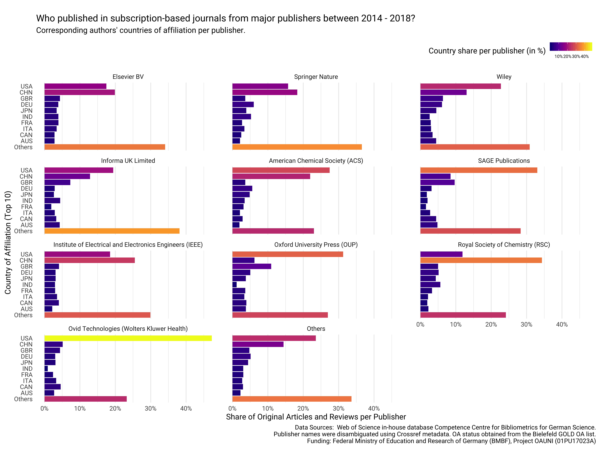

Data Descriptor: Corresponding author journal publishing activities
2014-2018
================

## Background & summary

Assessing the volume and share of corresponding author publications is
crucial for the planning of open access funding programs and licensing
models (Schimmer, Geschuhn, and Vogler 2015). However, funders and
national library consortia often lack access to bibliometric data, which
allow for determining the publication output per publisher, journal and
journal business model across countries. Here, by obtaining country
affiliations from the Web of Science, and combining them with normalized
publisher and open access status information for journals, we created a
dataset about the productivity of corresponding authors for the period
2014-2018. This dataset is expected to have essential value for the
quantitative understanding of scholarly publishing. It will not only
help to analyze the market share of publishing houses, but will also
uncover the current state of the transition of subscription-based
publishing models to fully open access.

Only a few openly available datasets focusing on the scholarly
publishing industry exist. For example, Haustein, Larivière, and Mongeon
(2015) shared an aggregated dataset that contains the market share of
publishers in terms of articles indexed in the Web of Science between
1973-2013. Using this data, the authors were able to reveal a growing
market concentration among a few publishing houses (Larivière, Haustein,
and Mongeon 2015). Palzenberger (2015) provided a dataset presenting the
number and proportion of scholarly articles by country of affiliation
including a breakdown by author role for the period 2004-2014. Published
in 2015, this dataset, which was obtained from the Web of Science
in-house database from the German Competence Center for Bibliometrics,
formed the empirical basis for demonstrating that a large-scale
transition from a subscription-based to an open access business model
would be financially feasible in terms of the global amount spent on
subscriptions (Schimmer, Geschuhn, and Vogler 2015). Since then,
analyzing corresponding author publications has become a critical
component of open access negotiations between library consortia and
publishers (Geschuhn and Stone 2017).

There have also been analytical applications for such datasets. Major
bibliometric databases including the Web of Science, Scopus and
Dimension have started to integrate open access status information. In
these databases, Unpaywall data is often used to identify openly
available full-texts at the article-level, while the Directory of Open
Access Journals provides information on whether a journal is fully open
access. In its most recent edition, the Leiden Ranking presents open
access indicators at the level of universities (Leeuwen, Costas, and
Robinson-Garcia 2019). In addition to university-specific data, the
German Open Access Monitor provides breakdowns by publisher and journal
and includes publications from non-university research institutions
based in Germany (Mittermaier et al. 2018). In its [Publisher Analytics
Reports](https://clarivate.com/webofsciencegroup/solutions/publisher-analytics-reports/)
Clarivate Analtics presents the performance of publishers across
subjects, institutions and countries based on Web of Science data.

Here, we build an open dataset on the global productivity of
corresponding authors. Drawing on Palzenberger’s (2015) previous work,
we created an updated dataset that reveals the number and proportion of
scholarly articles published per country, according to the corresponding
author affiliation. The dataset also allows for a global breakdown by
journal, including information whether it was operated as a subscription
or fully open access journal, and by publishers. We constructed the
dataset using the quality-assured Web of Science in-house database from
the German Competence Center for Bibliometrics. We enriched the data
with publisher information from Crossref, a large DOI registration
agency for scholarly work, and with open access journal information
provided by the ISSN-GOLD-OA list, a dataset that merges open access
journal information from the DOAJ, OpenAPC, PubMed and ROAD (Bruns et
al. 2019).

The data not only provides background information for negotiations in
the context of transformative agreements, but can also be used in the
quantitative study of the scholarly publishing industry and the uptake
of open access publishing across countries. For instance, national
transformative agreements with large publishers will increase authors’
opportunities to publish open access, and the existence of such
agreements is therefore likely to have an impact on the open access
share of a country with such agreements. To demonstrate the dataset’s
significance, we will present two new findings using the dataset: a
global map of publishers’ market shares, and an analysis of country of
affiliation by publisher. The source code used for compiling the dataset
is shared along with the resulting datasets.

## Methods

Following Palzenberger (2015), data were retrieved from the in-house Web
of Science database maintained by the German Competence Center for
Bibliometrics (KB Web of Science). The following data were obtained and
aggregated:

  - Web of Science core collections SCI, SSCI and AHCI
  - Article types Original Articles and Reviews
  - Countries of affiliation
  - ISSN
  - Publication years 2014 - 2018
  - Author roles, interpreting the role “reprint author” as
    corresponding authorship.

Like Palzenberger (2015), the above-listed selection reflects data needs
in the context of open access negotiations between library consortia and
publishers. The restriction to the article types original article and
review is in accordance with most open access contracts where other
types of journal content, such as letters or meeting abstracts, are not
considered (see for instance Sander et al. (2019)).

To allocate open access costs to institutions, Schimmer, Geschuhn, and
Vogler (2015) proposed using affiliations from corresponding authors,
presuming that corresponding author affiliations can be counted
straight. Under this counting method, only one institution or one
country receives full credit for a publication (Huang, Lin, and Chen
2011). However, there have been some concerns raised over using
corresponding authorship’s data from bibliometric databases for cost
analysis recently. Gumpenberger, Hölbling, and Gorraiz (2018) noted two
potential issues: multiple corresponding author affiliations and
multiple corresponding authors per article.

Indeed, the Web of Science has recently begun to systematically keep
track of more than one corresponding author per paper: We have found
that the Web of Science recorded more than one corresponding author for
6.2% of indexed articles published between 2014 - 2018. However, Figure
1 suggests that indexing of more than one corresponding author started
in 2016. Moreover, 5% of corresponding authors had multiple affiliations
from different countries (see Figure 2). We therefore decided to use
whole counting in which every original article or review was counted
once per country of affiliation of the corresponding author(s).

<!-- is the 'derived from wos_b_2019...' line really necessary in this file? only relevant for people with wos-access who know the tables-->

After obtaining aggregated article counts at the level of countries and
journals from the Web of Science, Crossref’s REST API was queried using
the rcrossref package (Chamberlain et al. 2019) to retrieve publishers
and journal titles. To control for developments of the publishing market
resulting in name changes of publishers or journal titles over time,
only the most frequent field name for the specific journal was used from
the API facet counts. Drawing on ISSN-L, a journal identifier that links
between different media versions of a journal, ISSN variants were
obtained to improve the retrieval. Next, the open access status per
journal was identified and added to the dataset using the ISSN-Gold-OA
3.0 list (Bruns et al. 2019). Again, ISSN-L were used for the matching
procedure.

## Data and code availability

The underlying source code in R and SQL for both testing the retrieval
and compiling the datasets are openly shared as executable reports,
making our data work more reproducible and transparent. The data
analytics work, which was organized as a research compendium (Marwick,
Boettiger, and Mullen 2018) using the holepunch R package (Ram 2019), is
accessible at <https://github.com/subugoe/oa2020cadata>.

More specifically, the following database retrieval steps were tracked
using R Markdown, a reproducible authoring framework supporting various
programming languages including R and SQL, and are accessible in the
`analysis` folder of the research compendium:

1.  Initial exploration on how corresponding authorships are represented
    in the WoS-KB
    ([`001_kb_rp_pretest.Rmd`](analysis/001_kb_rp_pretest.Rmd))
2.  Coverage analysis of reprint authors in the WoS-KB for the period
    2014 - 2018
    ([`002_kb_rp_coverage.Rmd`](analysis/002_kb_rp_coverage.Rmd)).
3.  Steps to obtain and compile the dataset relative to corresponding
    author country affiliations 2014 - 2018
    ([`003_kb_fetch_ca.Rmd`](analysis/003_kb_fetch_ca.Rmd))
4.  Steps to obtain and compile the dataset relative to the global
    publisher output 2014 - 2018
    ([`004_kb_fetch_publisher.Rmd`](analysis/004_kb_fetch_publisher.Rmd)).

The research compendium contains the rendered reports as well.
Furthermore, this source code repository includes comprehensive
reproducibility guidance for users with access to the in-house data
infrastructure provided by the Competence Centre for Bibliometrics for
German Science.

## The Dataset

Overall, our dataset consists of the following two separate tables:

  - `journal_publisher_14_18`: Global journal and publisher data 2014-18
  - `rp_publisher_14_18.csv`: Corresponding author country affiliations
    per publisher and journal 2014-18

They are provided as comma-separated values (csv) files and Excel
spreadsheets (xlsx).

The data are openly available in the `data/` of the research compendium
hosted on GitHub <https://github.com/subugoe/oa2020cadata>.

### Global journal and publisher data

The first file, named `journal_publisher_14_18`, contains information
about the publishing market landscape for the period 2014-2018 in terms
of the aggregated number of articles and reviews by year and journal
represented by the ISSN identifier indexed in the Web of Science. Table
1 describes the data variables in detail. We were able to retrieve
publisher and journal title from Crossref for 91% of all journals,
representing 96 % of the overall article volume. 1,981 out of 12,305
investigated journals with `ISSN-L` were identified as fully open access
journals. In total, the dataset provides information for 8,151,911
records indexed in the Web of Science with journal information in the
five-year period 2014-2018. Journals that could not be matched with the
`ISSN-L` or Crossref are marked with
`NA`.

<!-- are only journals with valid issn considered? Are there journals in the dataset without issn-l?-->

<!--what about the 9% that could not be matched with crossref? are they excluded or included with WoS information /without journal information?-- per Wos ISSN-->

Data Schema
`journal_publisher_14_18`:

| Variable           | Description                                                                                                                                 | Source                                                                                         |
| :----------------- | :------------------------------------------------------------------------------------------------------------------------------------------ | :--------------------------------------------------------------------------------------------- |
| `issn_wos`         | ISSN, a standardized journal id.                                                                                                            | KB Web of Science: `wos_b_2019.issues.issn`                                                    |
| `publication_year` | Year of publication, obtained from KB Web of Science                                                                                        | KB Web of Science: `wos_b_2019.items.pubyear`                                                  |
| `articles`         | Number of original articles and reviews published.                                                                                          | KB Web of Science: Grouped counts over `wos_b_2019.issues.issn` and `wos_b_2019.items.pubyear` |
| `journal_title`    | Most frequently used journal title in terms of articles published between 2014 - 2018. If missing, the journal was not indexed in Crossref  | Crossref                                                                                       |
| `publisher`        | Most frequently used publisher name in terms of articles published between 2014 - 2018. If missing, the journal was not indexed in Crossref | Crossref                                                                                       |
| `oa_journal`       | Is the journal publishing all articles open access without delay (full open access)?                                                        | ISSN-GOLD\_OA List 3.0                                                                         |
| `issn_l`           | Linking ISSN, a journal id that groups different media of the same serial publication, e.g. ISSN for print with electronic ISSN.            | CIEPS                                                                                          |

### Corresponding author data

The dataset named `rp_publisher_14_18` provides a breakdown of journal
information aggregated by countries of affiliation. Only corresponding
authorships, indicated by the role “reprint author” in the Web of
Science database, were taken into consideration. The following table
describes the variables in detail. Overall, 99% of records representing
original articles and reviews in the period 2014 - 2018 had affiliation
information for corresponding authors at the country-level.

Data
Schema:

| Variable           | Description                                                                                                                                 | Source                                                                        |
| :----------------- | :------------------------------------------------------------------------------------------------------------------------------------------ | :---------------------------------------------------------------------------- |
| `country_code`     | Country of affiliation corresponding author, represented as ISO 3 code                                                                      | KB Web of Science: `wos_b_2019.d_items_authors_institutions.inst_countrycode` |
| `publication_year` | Year of publication, obtained from KB Web of Science                                                                                        | KB Web of Science: `wos_b_2019.items.pubyear`                                 |
| `publisher`        | Most frequently used publisher name in terms of articles published between 2014 - 2018. If missing, the journal was not indexed in Crossref | Crossref                                                                      |
| `oa_journal`       | Is the journal publishing all articles open access without delay (full open access)?                                                        | ISSN GOLD OA List V3                                                          |
| `n_publications`   | Number of original articles and reviews published                                                                                           | Aggregate data                                                                |
| `n_journals`       | Number of distinct journals with corresponding publication output                                                                           | Aggregate data                                                                |

<!--### Corresponding author co-authorship network -->

## Use-cases

### Global publisher market share

Based on the dataset `journal_publisher_14_18` the global market share
of publishing houses as measured by articles and reviews indexed in the
Web of Science can be analyzed for the period 2014-18. The following
table shows the overall market share of the ten largest publishers. The
following figure presents a breakdown by journal business model,
differentiating between subscription journals and fully open access
journals.

| Publisher                                                | Articles and Reviews published | Percentage |
| :------------------------------------------------------- | -----------------------------: | ---------: |
| Elsevier BV                                              |                      1,954,416 |       24.0 |
| Springer Nature                                          |                      1,137,230 |       13.9 |
| Wiley                                                    |                        712,835 |        8.7 |
| Informa UK Limited                                       |                        415,088 |        5.1 |
| American Chemical Society (ACS)                          |                        219,525 |        2.7 |
| SAGE Publications                                        |                        192,969 |        2.4 |
| Royal Society of Chemistry (RSC)                         |                        189,669 |        2.3 |
| Institute of Electrical and Electronics Engineers (IEEE) |                        179,006 |        2.2 |
| Oxford University Press (OUP)                            |                        177,365 |        2.2 |
| Ovid Technologies (Wolters Kluwer Health)                |                        150,277 |        1.8 |
| Other                                                    |                      2,823,531 |       34.6 |
| Total                                                    |                      8,151,911 |      100.0 |

Publisher Market Share 2014 - 2018 as measured by articles and reviews
indexed in the Web of Science

<!-- Warum ist ab hier bei den Grafiken das Funding mit angegeben, bei den vorherigen jedoch nicht?-->

Our data confirms that the global publishing landscape is dominated by a
few large publishers. In total, ten publishers accounted for around
two-thirds of articles published between 2014 - 2018. The Big Three,
Elsevier, Springer Nature and Wiley, secured a market share of 46 %.
However, further analysis suggests large differences between
subscription and fully open access journals: the market of fully open
access journals seems to be less dominated by major publishing houses. A
notable exception is Springer Nature with its large fully open access
portfolio including BioMed Central and the large mega-journals
Scientific Reports and Nature Communications.

### Global Map of Journal Publishing

Using `rp_publisher_14_18.csv` the publisher market shares can be
further broken down by country affiliation of corresponding authors. The
following figure presents a global map of scholarly journal publishing
represented in the Web of Science. Publications from institutions based
in the European Union were summarized as “EU28”, and, together,
constitute the largest market for journal publishing between 2014-18.
The figure further highlights the consistency of market dominance of the
same set of large publishers across all regions of the world.

The following figure shows the country share per publisher as measured
by original articles and reviews published in subscription journals
using corresponding author affiliations. The flipped x-axis shows the
top 10 based on affiliations and articles published, while the y-axis
depicts the percentage per publisher. The figure indicates, which
countries were of particular relevance for a publisher. Furthermore, it
suggests large variations across publishers. Take, for instance, the
publisher Royal Society of Chemistry (RSC). Around every third article
published in a subscription journal of RSC was submitted by an author
based in China, while the overall share of China-based authors was
significantly lower with 17 %.

### Discussion and outlook

As country-level consortia increasingly embrace transformative
agreements as a means to increase the proportion of their research
published open access,\[1\] the dataset constitutes a highly useful
resource for researchers and practitioners alike. When combined with
information on a country’s own subscription and hybrid APC expenditure,
bibliometric data about corresponding author affiliation can help
national consortia cost model for a fully open access future and derive
key insights such as:

  - What is the total research output of our authors?
  - How fast is our output growing?
  - What percentage of our authorship is as corresponding author
    (responsible for open access publishing costs)?
  - How much of our output is already published fully open access?
  - With which publishers do our authors most frequently publish?
  - How does the publisher distribution of our output relate to our
    subscription expenditure?
  - Would a shift to open access with publisher X cost more, less or the
    same as what we currently spend on subscriptions (and hybrid APCs)?
  - What value can we place on authorship and open access publishing
    services?

## Responsible use and limitations

Although the Web of Science database is a well-established bibliometric
database it has certain limitations that need careful consideration when
using and interpreting our data. First, the Web of Science is selective
in terms of journal inclusion and does not covering the whole journal
portfolio of the investigated publishers. There is also evidence about a
considerable indexing gap of non-English journal publications relevant
to domestic research (Pineiro and Hicks 2015). Although publisher names
were disambiguated, journal title transfers between publishers were not
tracked. Furthermore, the year of inclusion in a journal issue,
i.e. print publication date, was used. However, there can be a
considerable time-lag between online-first publication and issue
inclusion.

Moreover, as is the case with any other bibliometric database, the data
structure can be subject to change. In particular, as mentioned above,
our pretests suggest that the Web of Science author role field used to
identify corresponding authorships has undergone a change recently,
starting to cover more than one reprint or corresponding author per
article in 2016.

The ISSN GOLD-OA list (Bruns et al. 2019) was used to determine fully
open access journals. However, it does not contain information when a
subscription-based journal became fully open access. The figures should
therefore be interpreted as numbers of articles available in current
fully open access journals, rather than as published in a fully open
access journal at the time of publication.
<!-- Open access article counts are therefore upper estimates.  Is it really upper estimates? What about reverse flip?-->

In the end, we present a novel bibliometric dataset representing the
journal publishing market with a particular focus on open access.
Although access to the underlying data infrastructure is restricted, we
decided to openly share the aggregated dataset as part of a research
compendium to ensure the technical reproducibility of this work.

## Acknowledgment

This work uses Web of Science data by Clarivate Analytics provided by
the German Competence Center for Bibliometrics for research purposes.

This work is supported by the Federal Ministry of Education and Research
of Germany (BMBF) in the framework Quantitative Research on the Science
Sector (Project: “OAUNI Entwicklung und Einflussfaktoren des
Open-Access-Publizierens an Universitäten in Deutschland”,
Förderkennzeichen: 01PU17023A).

## References

Bruns, Andre, Christopher Lenke, Constanze Schmidt, and Niels Christian
Taubert. 2019. “ISSN-Matching of Gold OA Journals (ISSN-GOLD-OA) 3.0.”
Bielefeld University. <https://doi.org/10.4119/unibi/2934907>.

Chamberlain, Scott, Hao Zhu, Najko Jahn, Carl Boettiger, and Karthik
Ram. 2019. *Rcrossref: Client for Various ’Crossref’ ’Apis’*.
<https://CRAN.R-project.org/package=rcrossref>.

Geschuhn, Kai, and Graham Stone. 2017. “It’s the Workflows, Stupid\!
What Is Required to Make ‘Offsetting’ Work for the Open Access
Transition.” *Insights the UKSG Journal* 30 (3): 103–14.
<https://doi.org/10.1629/uksg.391>.

Gumpenberger, Christian, Lothar Hölbling, and Juan Ignacio Gorraiz.
2018. “On the Issues of a Corresponding Author Field-Based Monitoring
Approach for Gold Open Access Publications and Derivative Cost
Calculations.” *Frontiers in Research Metrics and Analytics* 3
(February). <https://doi.org/10.3389/frma.2018.00001>.

Haustein, Stefanie, Vincent Larivière, and Philippe Mongeon. 2015. “Data
for: The Oligopoly of Academic Publishers in the Digital Era.” Figshare.
<https://doi.org/10.6084/m9.figshare.1447274.v1>.

Huang, Mu-Hsuan, Chi-Shiou Lin, and Dar-Zen Chen. 2011. “Counting
Methods, Country Rank Changes, and Counting Inflation in the Assessment
of National Research Productivity and Impact.” *Journal of the American
Society for Information Science and Technology* 62 (12): 2427–36.
<https://doi.org/10.1002/asi.21625>.

Larivière, Vincent, Stefanie Haustein, and Philippe Mongeon. 2015. “The
Oligopoly of Academic Publishers in the Digital Era.” *PLOS ONE* 10 (6):
e0127502. <https://doi.org/10.1371/journal.pone.0127502>.

Leeuwen, Thed van, Rodrigo Costas, and Nicolas Robinson-Garcia. 2019.
“Indicators of Open Access Publishing in the Cwts Leiden Ranking
2019.” <https://www.cwts.nl/blog?article=n-r2w2a4>.

Marwick, Ben, Carl Boettiger, and Lincoln Mullen. 2018. “Packaging Data
Analytical Work Reproducibly Using R (and Friends).” *The American
Statistician* 72 (1): 80–88.
<https://doi.org/10.1080/00031305.2017.1375986>.

Mittermaier, Bernhard, Irene Barbers, Dirk Ecker, Barbara Lindstrot,
Heidi Schmiedicke, and Philipp Pollack. 2018. “Der Open Access Monitor
Deutschland.” *O-Bib. Das Offene Bibliotheksjournal* 5 (4).
<https://doi.org/10.5282/o-bib/2018h4s84-100>.

Palzenberger, Margit. 2015. “Number of Scholarly Articles Per Country.”
Max Planck Digital Library. <https://doi.org/10.17617/1.2>.

Pineiro, C. Lopez, and D. Hicks. 2015. “Reception of Spanish Sociology
by Domestic and Foreign Audiences Differs and Has Consequences for
Evaluation.” *Research Evaluation* 24 (1): 78–89.
<https://doi.org/10.1093/reseval/rvu030>.

Ram, Karthik. 2019. *Holepunch: Configure Your R Project for
’Binderhub’*. <https://github.com/karthik/holepunch>.

Sander, Frank, Guido Hermann, Horst Hippler, Gerard Meijer, and Ralf
Schimmer. 2019. “Projekt Deal – John Wiley and Son Publish and Read
Agreement.” <https://doi.org/10.17617/2.3027595>.

Schimmer, Ralf, Kai Geschuhn, and Andreas Vogler. 2015. “Disrupting the
subscription journals’business model for the necessary large-scale
transformation to open access.” Max Planck Digital Library.
<https://doi.org/10.17617/1.3>.

1.  See the ESAC registry for an up-to-date list of transformative
    agreements from national consortia
    <https://esac-initiative.org/about/transformative-agreements/agreement-registry/>
